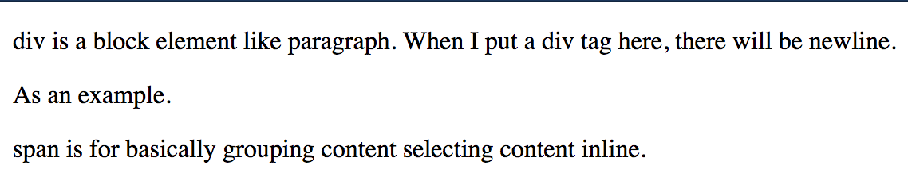

# Section 03: Introduction to HTML

## [1 - HTML Elements Reference](https://developer.mozilla.org/en-US/docs/Web/HTML/Element)

## 2 - Divs And Spans

Source code:

Output code:

## [3 - HTML Attributes](https://developer.mozilla.org/en-US/docs/Web/HTML/Attributes)

