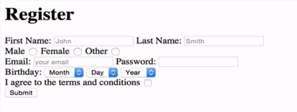

# Section 04: Intermediate HTML

Form tag is a basically shell or a container for all of these different types of [inputs](https://developer.mozilla.org/en-US/docs/Web/HTML/Element/input).

```html
<form action="the URL to send form data to" method="the type of HTTP request">
  <label for="username">Username:</label>
  <input id="username" name="username" placeholder="username" type="text" required>
  
  <label for="password">Password:</label>
  <input id="password" name="password" placeholder="password" type="password" required>
  
  <input type="email">
  
  <input type="radio">
  <input type="checkbox">
  <input type="date">
  <input type="color">
  <input type="file">
  <textarea row="10" cols="20"></textarea>
  <input type="submit">
</form>

HTTP method: 'GET'  request for searching or retrieving data.
HTTP method: 'POST' request for sending data to a server.

If someone is blind, their screen reader software will use <label> tags to know which part of the form corresponds to.
```


```html
<form action="www.google.com" method="POST">
  <!-- Below radio buttons can both be selected. -->
  <input type="radio" value="1">
  <input type="radio" value="2">
  
  <!-- Either 3 or 4 will be selected because they are grouped by name attribute. -->
  <input type="radio" value="3" name="eitherThisOrThat">
  <input type="radio" value="4" name="eitherThisOrThat">
  
  <select name="mood">
    <option value="happy"> :) </option>
    <option value="neutral"> :| </option>
    <option value="sad"> :( </option>
  </select>
</form>
```

## 1 - Form Exercise



