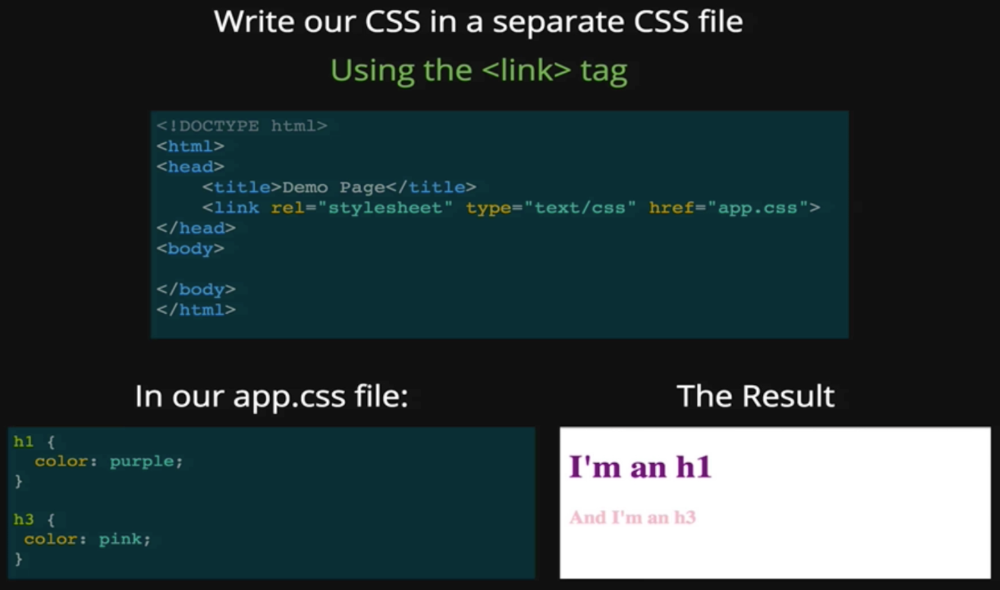

# Section 05: Introduction to CSS

[Reference: csszengarden.com](http://csszengarden.com/)



```css
h1{
  color: red;
  color: #FF0000; 
  color: rgb(255, 0, 0);
  color: rgba(255, 0, 0, .6);
  //	RGBA is just like RGB but with an alpha(transparency) channel. Ranges from 0.0 - 1.0
  
  border-width: 2px;
  border-style: solid;
  border-color: purple;
  
  border: 2px solid purple;
}
```


```css
body{
  background: url(image-url);
  background-repeat: no-repeat;
  background-size: cover;
}
```

## 1 - CSS Selectors

[Reference: Codepen.io 1](https://codepen.io/thomaston/full/dMbYzP)

[Reference: Codepen.io 2](https://codepen.io/nana8/full/aXQgoj)

## [2 - CSS Specificity](https://developer.mozilla.org/en-US/docs/Web/CSS/Specificity)

[Reference: Specificity Calculator](https://specificity.keegan.st/)

