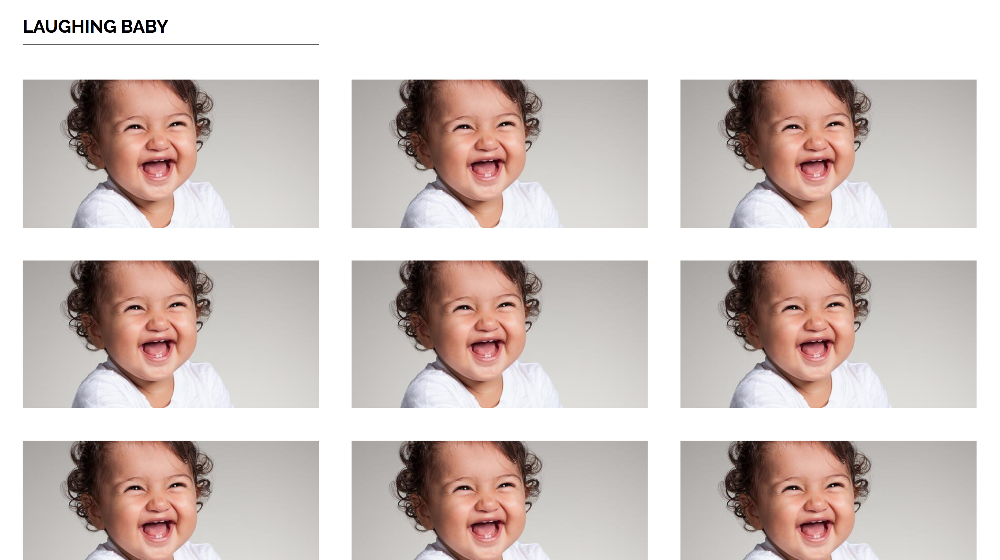

# Section 06: Intermediate CSS

[Reference: MDN - CSS Fonts](https://developer.mozilla.org/en-US/docs/Web/CSS/font)

## [1 - Box Models](https://developer.mozilla.org/en-US/docs/Web/CSS/CSS_Box_Model/Introduction_to_the_CSS_box_model)

> When laying out a document, the browser's rendering engine represents each element as a rectangular box according to the standard **CSS basic box model**. CSS determines the size, position, and properties (color, background, border size, etc.) of these boxes.
>
> Every box is composed of four parts (or *areas*), defined by their respective edges: the *content edge*, *padding edge*, *border edge*, and *margin edge*.


```css
p{
  margin: 0 auto 0 auto;	//	Paragraph will be centered.
  margin: 0 auto;					//	Same as above.
  margin: auto;						//	Same as above.
}
```

## 2 - Creating A Tic Tac Toe Board


## 3 - Image Gallery



```css
img{
  float: left;
}

// By floating the images we got rid of the white space that the browser added for us.
```

[Reference: Google Fonts](https://fonts.google.com/)

