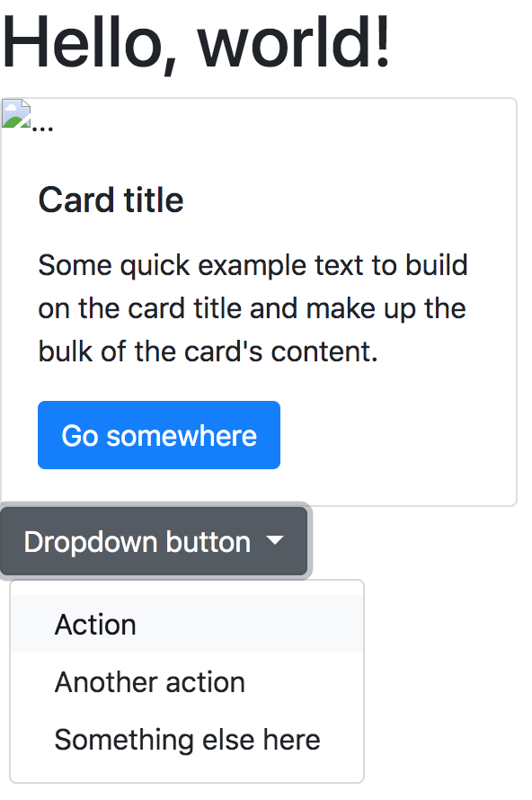
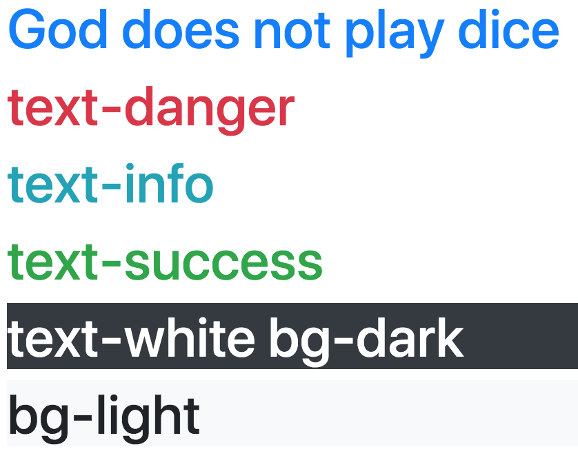
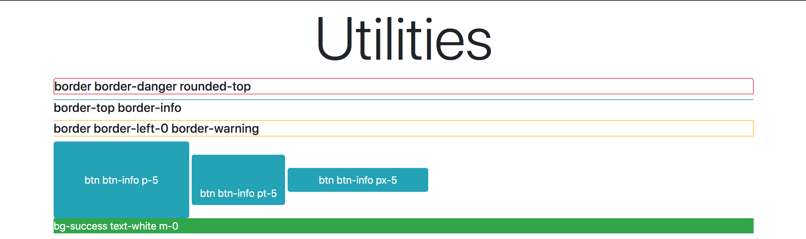
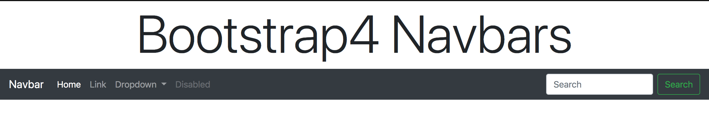
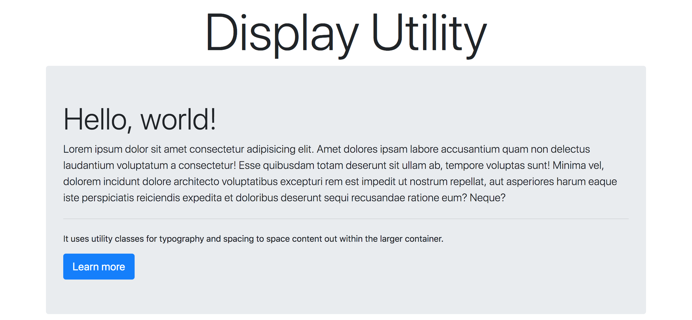

# Section 8 : Bootstrap 4

## 0 - A History of Bootstrap 4
- **In alpha release** is usually the first release and you're basically telling everyone this is very buggy, potentially things are very liable to change.
- **In beta release** is a point where it's done enough and you're not going to do some massive alterations you might be tweaking performance things behind the scenes. Reorganizing the code at that point. It would be released as stable release. 

## 1 - Changes from Bootstrap 3 to 4
[4.3 migration tab on getbootstrap.com](https://getbootstrap.com/docs/4.3/migration/) details all of the changes and it starts with the most recent changes from beta 3 to the stable release.

**Flexbox** is a system for positioning moving around elements for laying out your web page and it makes things a lot easier a lot less messy.

## 2 - Getting Started With Bootstrap 4
**[Popper](https://popper.js.org/)** does popups and drop downs in Bootstrap4.

1. Copy the [starter template](https://getbootstrap.com/docs/4.3/getting-started/introduction/#starter-template) into index.html.
2. Add [card component](https://getbootstrap.com/docs/4.3/components/card/#example).
3. Add [single button](https://getbootstrap.com/docs/4.3/components/dropdowns/#single-button).



## 3 - Bootstrap 4 Colors and Backgrounds

See [colors](https://getbootstrap.com/docs/4.3/utilities/colors/) page of Bootstrap 4.



## 4 - [Typography](https://getbootstrap.com/docs/4.3/content/typography/)
1. **[rem](https://medium.com/code-better/css-units-for-font-size-px-em-rem-79f7e592bb97)** is a relative unit that basically takes the font size of the root which is the top level html element. For example **font-size: 6rem** stands for six times the default root value for font size which is 16. The result is 96px.
2. [Blockquotes](https://getbootstrap.com/docs/4.3/content/typography/#blockquotes) 


## 5 - New Fancy [Spacing](https://getbootstrap.com/docs/4.3/utilities/spacing/) Utilities

```
<h5 class="border border-danger rounded-top"> H5 </h5>
"border" for having border around the heading, 
"border-danger" specifies the color(red) of the border, 
"rounded-top" rounds the top corners ONLY.
```

```
<h5 class="border-top border-info"> H5 </h5>
"border-top" for having border ONLY the top of the heading,
"border-info" specifies the color of the border.
```

```
<h5 class="border border-left-0 border-warning"> H5 </h5>
"border" for having border around the heading,
"border-left-0" removes the left border line of the heading,
"border-warning" specifies the color(YELLOW) of the border.
```

```
<button class="btn btn-info px-5"> PX-5 </button>
"btn" for bootstrap button,
"btn-info" specifies the color,
"px-5" padding for both sides(left and right) 5 rem
```

```
<p class="bg-success text-white m-0"> M-0 </p>
"bg-success" specifies the color,
"text-white" specifies the text color,
"m-0" specifies the all margin 0.
```

For more information, please visit [borders](https://getbootstrap.com/docs/4.3/utilities/borders/) and [spacing](https://getbootstrap.com/docs/4.3/utilities/spacing/).



## 6 - [Responsive Breakpoints](https://getbootstrap.com/docs/4.3/layout/overview/#responsive-breakpoints)

```
<button class="btn btn-warning p-sm-5 p-md-0 p-lg-5 p-xl-0"> BUTTON </button>
```

```
<button class="btn btn-primary p-4 mx-0 mx-sm-2 mx-md-3 mx-lg-4"></button>
```


## 7 - Bootstrap 4 [Navbars](https://getbootstrap.com/docs/4.3/components/navbar/)

```
<nav class="navbar navbar-expand-lg navbar-dark bg-dark">
If you want your navbar to expand/collapse "navbar-expand-lg" is required.
You can still make a simple, static navbar without it.
```



## 8 - The New [Display](https://getbootstrap.com/docs/4.3/utilities/display/) Utility
