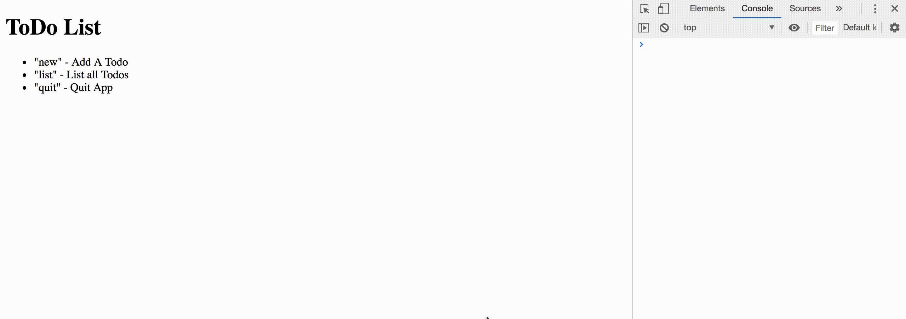
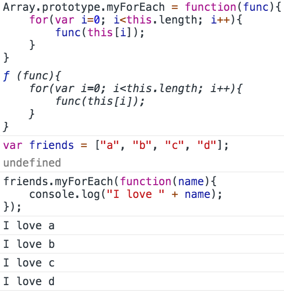

# Section 13: Javascript Basics - Arrays

## [Developer Mozilla - Javascript Array](https://developer.mozilla.org/en-US/docs/Web/JavaScript/Reference/Global_Objects/Array)

```
var colors = ["red", "green", "white"];

colors.indexOf("red");				//	returns 0
colors.indexOf("blue");				//	returns -1

colors.push("blue");				//	add new item to the end
var blue = colors.pop();			//	returns the last item and removes it.

colors.unshift("infrared");			//	add new item to the beginning
var infrared = colors.shift();		//	returns the first item and removes it.

var newColors = colors.slice(0,2);	//	newColors have "red" and "green"
var copyColors = colors.slice();    //	copyColors have all items of colors.
```

## 1 - ToDo List



**Chrome browser** behaves a little strangely when using alert, prompt, or confirm functions. It **doesn't display the HTML on the page until after the popup has been closed.** This is problematic since our HTML contains instructions for the user to be able to use the app we're building. You can avoid this by wrapping your JS code in the following setTimeout function:

```
var todos = [];

window.setTimeout(function(){
	var input = prompt("What would you like to do?");

	while(input !== "quit"){
		if(input === "list"){
			console.log(todos);
		}else if(input === "new"){
			var newTodo = prompt("Enter new todo.");
			todos.push(newTodo);
		}
		input = prompt("What would you like to do?");
	}
	console.log("See you !");

}, 500);
```

This gives the HTML a half second to load before running the JS, which circumvents the issue of the prompt function blocking the HTML from loading right away.

## [ForEach](https://developer.mozilla.org/en-US/docs/Web/JavaScript/Reference/Global_Objects/Array/forEach)
```
Javascript provides an easy built-in way of iterating over an array: ForEach

arr.forEach(someFunction)

var colors = ["red", "orange", "yellow", "green"];

colors.forEach(function(color){
	console.log(color);
});
```

## 2 - ToDo List Part 2


```
.forEach takes a callback function, that callback function is expected to have at least 1, but up to 3, arguments.

The arguments are in a specific order:
- The first one represents each element in the array (per loop iteration) that .forEach was called on.
- The second represents the index of said element.
- The third represents the array that .forEach was called on (it will be the same for every iteration of the loop).
```

## 3 - myForEach()
```
Array.prototype.myForEach = function(func){
	for(var i=0; i<this.length; i++){
		func(this[i]);
	}
}

var friends = ["a", "b", "c", "d"];
friends.myForEach(function(name){
	console.log("I love " + name);
});
```

