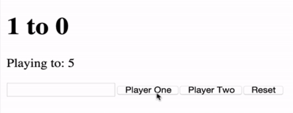
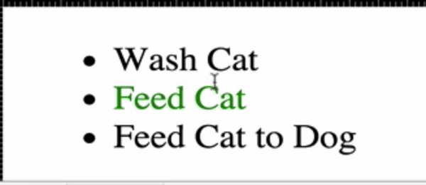

# Section 16 : Advanced DOM Manipulation

We select an element and then add an [event listener](https://developer.mozilla.org/en-US/docs/Web/Events). E.g. "Listen for a click on this <button>".

```javascript
element.addEventListener(type, functionCall);

var button = document.querySelector("button");
// button.addEventListener("click", sayClicked );
button.addEventListener("click", function(){
  console.log("SOMEONE CLICKED THE BUTTON.");
});


function sayClicked(){
  console.log("THIS TIME sayClicked function passed as argument to the listener.");
}
```


```javascript
var button = document.querySelector("button");
button.addEventListener("click", function(){
  documennt.body.classList.toggle("purple");
});

//	Here purple is a css class which is:
//	.purple{ background-color: purple; };
```


```javascript
var lis = document.querySelectorAll("li");

for(var i=0; i<lis.length; i++){
  lis[i].addEventListener("click", function(){
    this.style.color = "pink";
  });
};
```


The location of the <script> tags in the html IS IMPORTANT. If it is added to the bottom of the html file, the scripts will run after all doucment objects are created.**

```html
<html>
  <head>
    <script type="text/javascript" src="source.js"></script>
  </head>
  <body>
    
    <script type="text/javascript" src="source.js"></script>
  </body>
</html>
```

## 1 - ScoreKeeper



## 2 - ToDo List



```javascript
var lis = document.querySelectorAll("li");

for(var i=0; i<lis.length; i++){
  lis[i].addEventListener("mouseover", function(){
    this.classList.add("selected");
  });
  
  lis[i].addEventListener("mouseout", function(){
    this.classList.remove("selected");
  });
  
  lis[i].addEventListener("click", function(){
    this.classList.toggle("done");
  });
}
```


