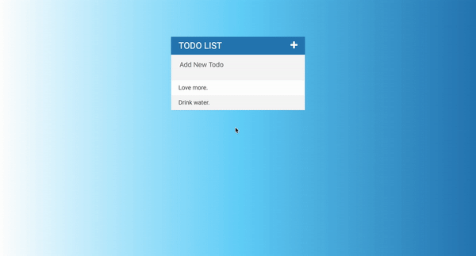

# Section 20 : Todo List Projects




```javascript
$("span").click(function(event){
  $(this).parent().fadeOut(500, function(){
    $(this).remove();
  });
  event.stopPropagation();
});

//stopPropagation() is a jQuery method that will stop the event from bubbling up.
```


```javascript
$("input[type='text']").keypress(function(event){
  if(event.which === 13){
    var todoText = $(this).val();
    $(this).val = "";
    $("ul").append("<li><span>X</span>" + todoText + "</li>");
  }
});
```


```javascript
$("ul").on("click", "li", function(){
  $(this).toggleClass("completed");
});

//We can only add a listener using jQuery on elements that exist when this code is run for the first time.
//We add a listener to the entire UL parent.
```


```javascript
<i class="fa fa-plus"></i>
```

[Reference: uigradients.com](https://uigradients.com/#Clouds)

[Reference: Font Awesome](https://stackpath.bootstrapcdn.com/font-awesome/4.7.0/css/font-awesome.min.css)

