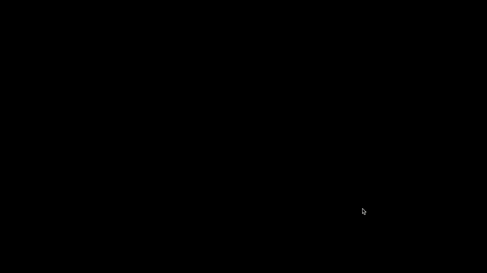

# Section 21 : Patatap Clone




### 1. Paper.js

> Paper.js is an open source vector graphics scripting framework that runs on top of the HTML5 Canvas.
>
> [Reference: Paperjs](http://paperjs.org/)

```html
<script type="text/paperscript" canvas="thisIdShouldMatch"></script>

...
<body>
  <canvas id="thisIdShouldMatch" resize hidpi="off" style="background:black"></canvas>
</body>
```

`Paperscript` is a domain specific language (DSL).

`canvas` is an html element that basically acts as a place to do animations and graphics. [Reference: MDN - Canvas](https://developer.mozilla.org/en-US/docs/Web/API/Canvas_API)


### 2. Howler.js

```javascript
var sound = new Howl({
  src: ['sound.webm', 'sound.mp3', 'sound.wav'],
  autoplay: true,
  loop: true,
  volume: 0.5,
  onend: function() {
    console.log('Finished!');
  }
});
```

[Reference: Howlerjs](https://howlerjs.com/)


### 3. Other Resources

[Reference: MDN - Cross Origin Resource Sharing](https://developer.mozilla.org/en-US/docs/Web/HTTP/CORS)

[Reference: Github - Neuronal Synchrony](https://github.com/jonobr1/Neuronal-Synchrony)

[Reference: YouTube - How to Add Paperscript Syntax Highlighting to Visual Studio Code](https://www.youtube.com/watch?v=-mHkmAZBkzo)