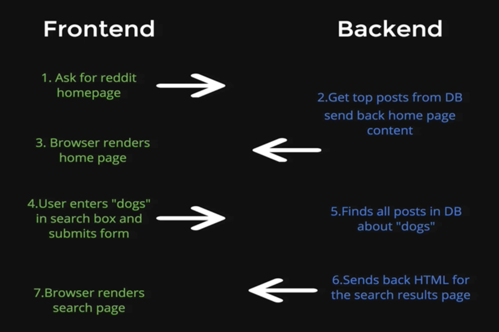
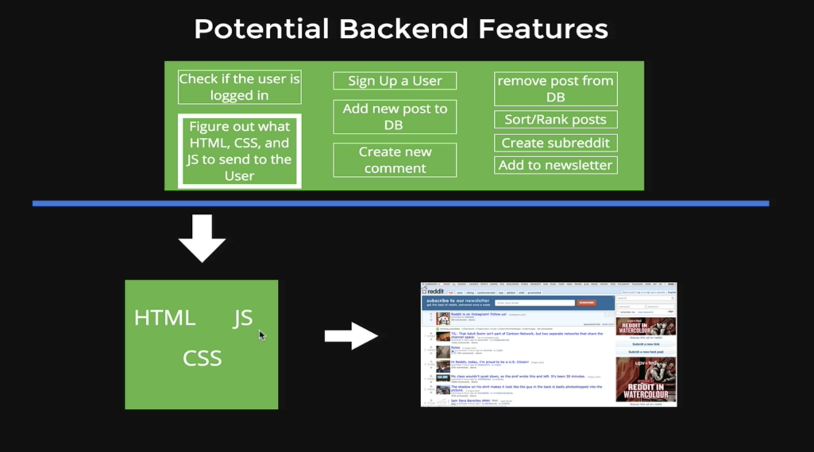

# Section 22 : Backend Basics

There are two different types of websites static pages and dynamic pages. Dynamic web pages are sites that are compiled on the server side where the server is pulling together or constructing a web page before it's sent back as a response.

### 1. Potential Backend Features

Stack is a term that's used to refer to all of the technologies that a particular web application uses. [Stackshare](https://stackshare.io/) is the place where you can see the stack of popular websites like [reddit.com](https://stackshare.io/reddit/reddit).

MEAN = MongoDB, Express, Angular, Node (we're not using Angular)

MEN = MongoDB, Express, Node (this is what we're using in this course)

### 2. [Postman](https://www.getpostman.com/)

### 3. [Goorme IDE](https://www.youtube.com/watch?v=iJtOoeM_fS8)