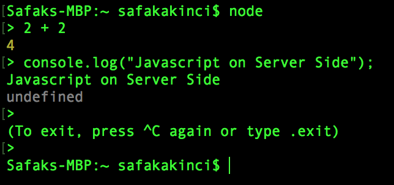
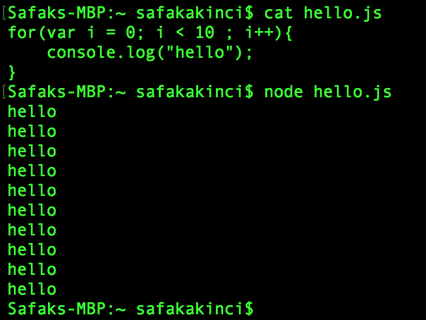
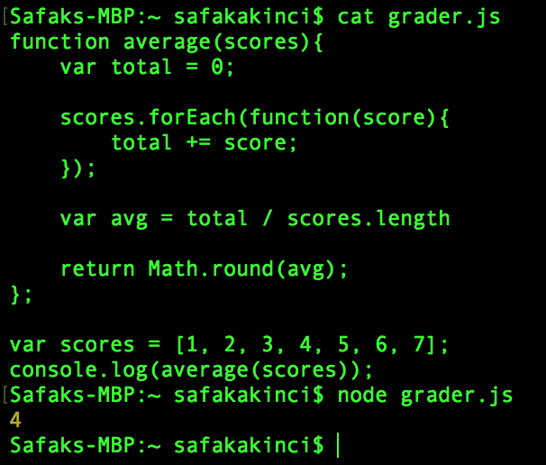

# Section 24 : [Node JS](https://nodejs.org/en/about/)

By the Node, Javascript can be used also on server side. You can learn [more](https://stackshare.io/nodejs).

REPL: Read Evaluate Print Loop





## [Node Package Manager](https://www.npmjs.com/)
NPM is the package manager for javascript.
Packages are just code that someone else has written.

- [cat-me](https://www.npmjs.com/package/cat-me)
- [faker](https://www.npmjs.com/package/faker)

```javascript
npm install faker
var faker = require("faker");
console.log( faker.commerce.price() );
```
