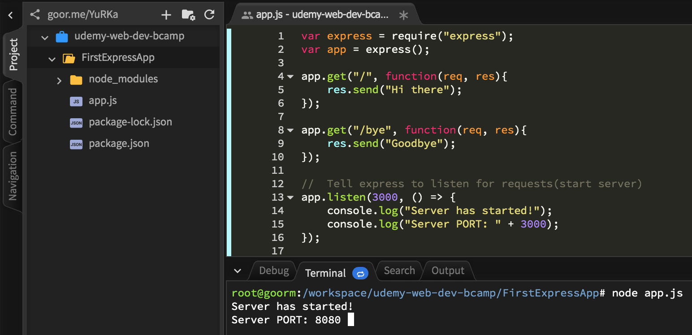
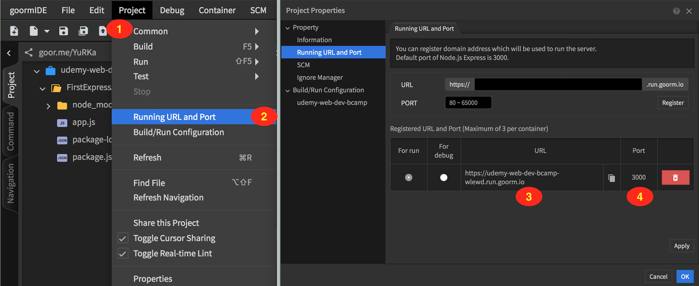
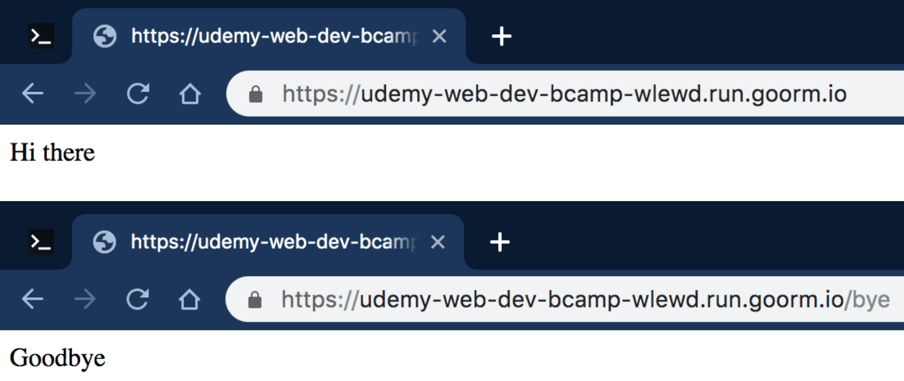
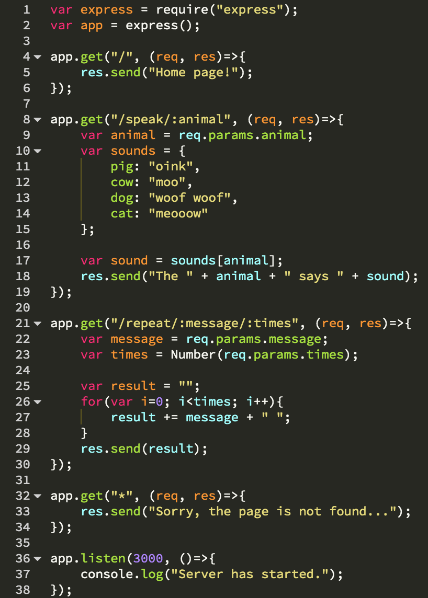
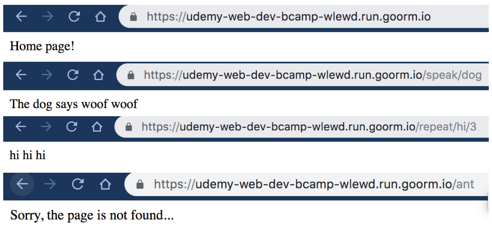

# Section 25 : Server Side Frameworks

> Basically, all the control flow is already in the framework, and there's just a bunch of predefined white spots that  you can fill out with your code. A library on the other hand is a collection of functionality that you can call.
>
> [Reference: Stackoverflow - Framework vs Toolkit vs Library](https://stackoverflow.com/questions/3057526/framework-vs-toolkit-vs-library)

## 1. Project Introduction







## 2. [Package.json](https://docs.npmjs.com/files/package.json)

All npm packages contain a file, usually in the project root, called `package.json` - this file holds various metadata relevant to the project. This file is used to give information to `npm` that allows it to identify the project as well as handle the project's dependencies.


When we install a package with `npm --save`, it will take the package name and version in automatically save it into `package.json`. Type command `npm init` to create a new `package.json` file.

## 3. [Automate Node Server Restart with Nodemon](https://youtu.be/GvLvrlOqq9g)

## 4. Order of Routes Does Matter !

The first route that matches the given request is the only route that will be run.

```javascript
app.get("*", (req, res)=>{
  res.send("This will be shown to the user EVERY TIME regardless of the parameters.");
});

app.get("/bye", (req, res)=>{
  res.send("Bye");
});

------------------------------------

app.get("/bye", (req, res)=>{
  res.send("Bye");
});

app.get("*", (req, res)=>{
  res.send("This will be shown to the user when the parameter is different from /bye.");
});
```


```javascript
app.get("main/:parameter", (req, res)=>{
  res.send(": is used to show parameter in node.");
  console.log(reg.params);
});
```

## 5. [Express Basic Exercise](https://goor.me/YuRKa)






