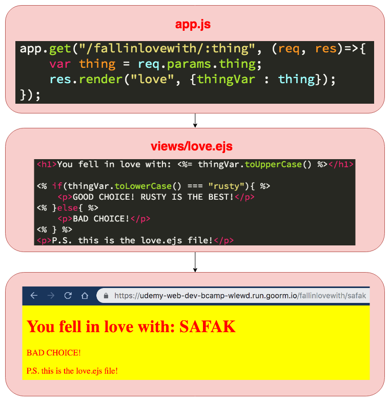
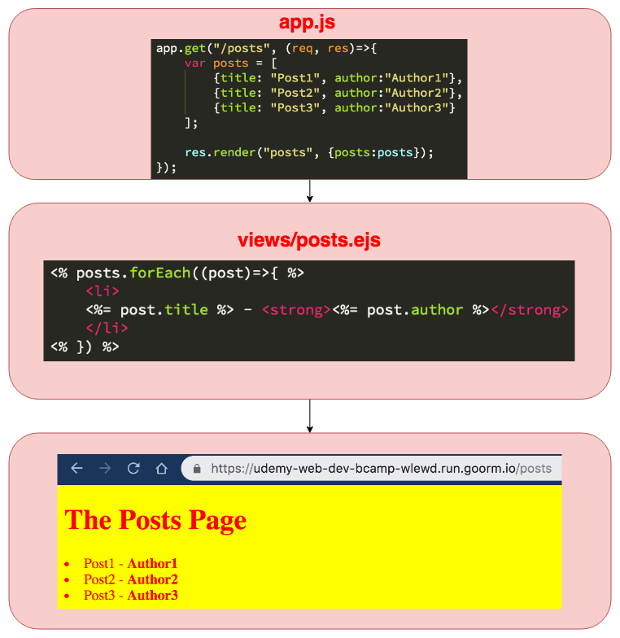
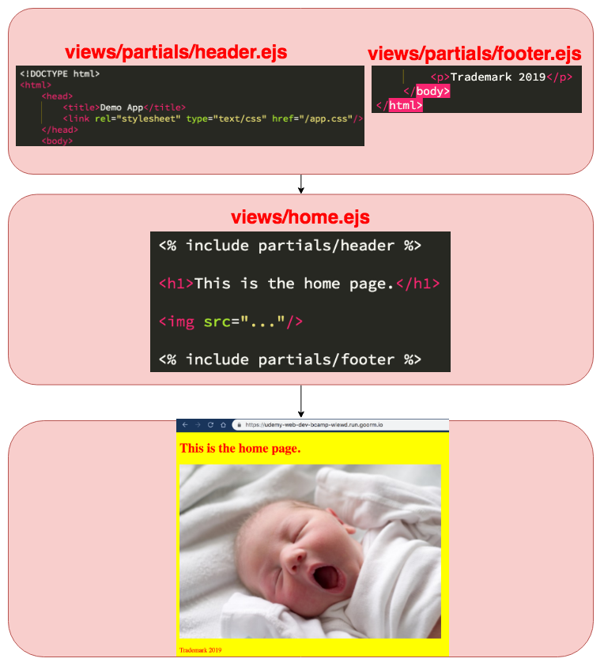
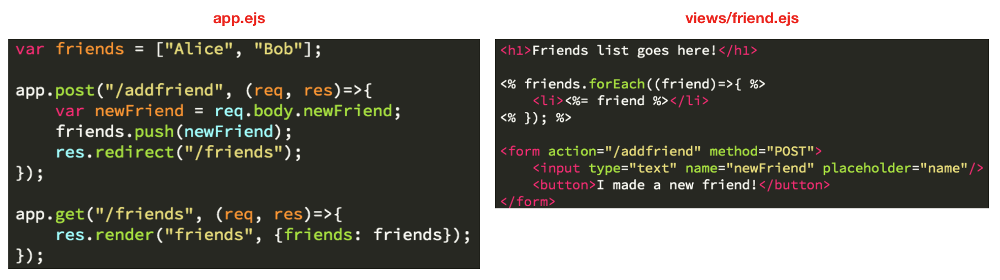
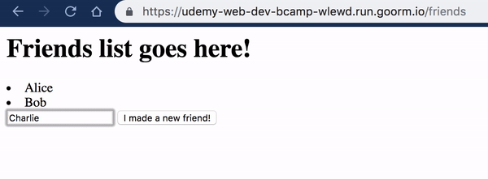

# Section 26 : Intermediate Express

## [1. Embedded Javascript (.ejs)](https://ejs.co/)

*EJS is a simple templating language that lets you generate HTML markup with plain JavaScript.* In other words, it embeds javascript codes(variables, for loops, if statements ) inside of html. To install, please type `npm install ejs --save`.



`res.render("love.ejs");` sends the **love.ejs** file as a response. **love.ejs** is a template and is located in **views** folder since, express try to find any ejs file inside views folder.

## 2. EJS: Conditionals and Loops

| Expression | Explanation                                          |
| ---------- | ---------------------------------------------------- |
| `<%= %>`   | The value will be returned and is added to the html. |
| `<% %>`    | It is used with if and for loop statements.          |



## 3. Serving Custom Assets

Express does not automatically serve every file it sees. The default is to not serve anything at all aside from the views directory. `app.use(express.static("public"));` serve the content of the public directory.


If we set view engine as ejs (`app.set("view engine", "ejs");`), then we don't need to write every single rendered file with the extension .ejs.


Partials are basically files, templates that we can write that we can include in other templates.



## 4. Post Requests

We use post route any time we are adding data to something, when we're sending data through and we want to add it to the database whether we're signing up a user or we're creating a new comment or creating a new post.


Express does not actually create the `req.body` for us. We need to explicitly tell it to take the request body and turn it into a javascript object for us to use called `req.body`. So to do that we actually need to install a package called body parser (`npm install body-parser --save`). Pretty much anytime we have a form that a user enters data into that we want to extract the data from on the server side, we need to use [body-parser.](https://www.npmjs.com/package/body-parser)

```javascript
var bodyParser = require("body-parser");
app.use(bodyParser.urlencoded({extended: true}));
```





