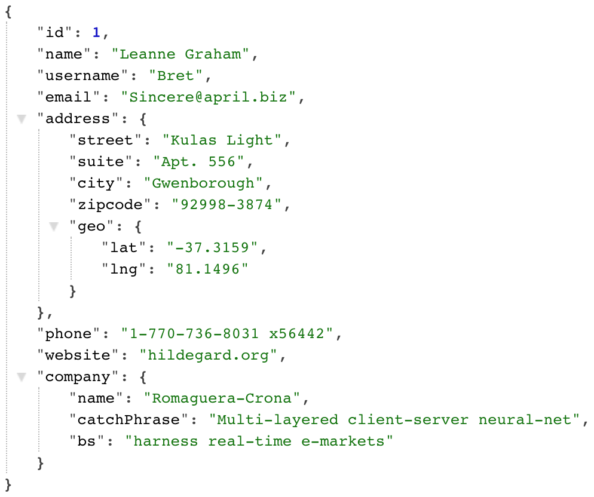
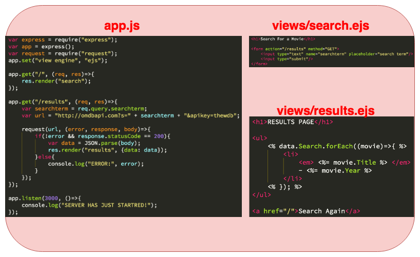
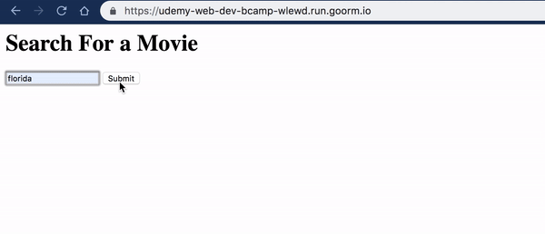

# Section 27 : Working With API's

## 1. [API(Application Programming Interface)](https://www.programmableweb.com/api-university/what-are-apis-and-how-do-they-work)

API's are interfaces for code/computers to talk to one another.

[programmableweb.com](https://www.programmableweb.com/)

[ifttt.com](https://ifttt.com/)

[Turkish - Api Nedir ?](https://blog.koddit.com/yazilim/api-nedir-ne-ise-yarar-orneklerle-inceleyelim/)

## 2. cURL (Client URL)

[What is cURL and why is it all over API docs?](https://dev.to/ibmdeveloper/what-is-curl-and-why-is-it-all-over-api-docs-9mh)

## [3. npm request](https://github.com/request/request)

Request is designed to be the simplest way possible to make http calls. It supports HTTPS and follows redirects by default.

```javascript
var request = require("request");
request("http://www.google.com", (error, response, body)=>{
  if(!error && response.statusCode == 200){
    console.log(body);
  }
});
```

## 4. [JSON Placeholder](https://jsonplaceholder.typicode.com/) Example

JSON Placeholder is a fake online REST API for Testing and Prototyping. Below, you see the JSON result of https://jsonplaceholder.typicode.com/users/1 request.



```javascript
const request = require("request");

request("https://jsonplaceholder.typicode.com/users/1", (error, response, body)=>{
  eval(require('locus'));
  if(!error && response.statusCode == 200){
    const parsedData = JSON.parse(body);
    console.log(parsedData["body"]["results"]["channel"]["astronomy"]);
		console.log(parsedData.body.results.channel.astronomy);
    
    console.log(parsedData.name + ' lives in ' + parsedData.address.city);
    console.log(`${parsedData.name} lives in ${parsedData.address.city}`);
  }
});
```

[Locus](https://www.npmjs.com/package/locus) is a debugging module which allows you to execute commands at runtime via a REPL.

### 4.1. [npm request-promise](https://www.npmjs.com/package/request-promise)

```javascript
const rp = require("request-promise");

rp("https://jsonplaceholder.typicode.com/users/1")
  .then((body)=>{
	  const parsedData = JSON.parse(body);
  	console.log(`${parsedData.name} lives in ${parsedData.address.city}`);
	})
	.catch((err)=>{
  	console.log('Error', err);
	});
```

## 5. Movie API App

[OMDb API](http://www.omdbapi.com/) is a free web service to obtain movie information.

`npm install --save express ejs request`





