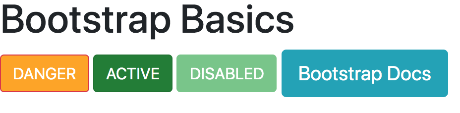
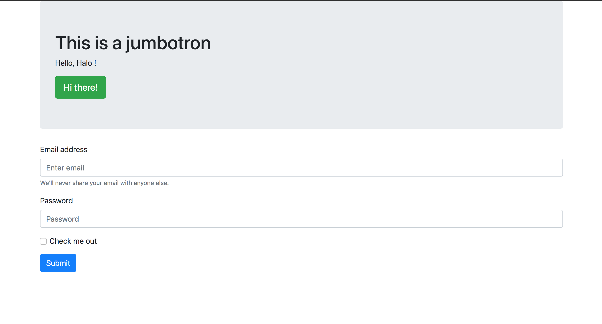
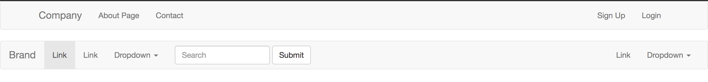
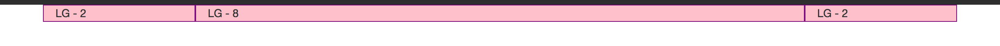
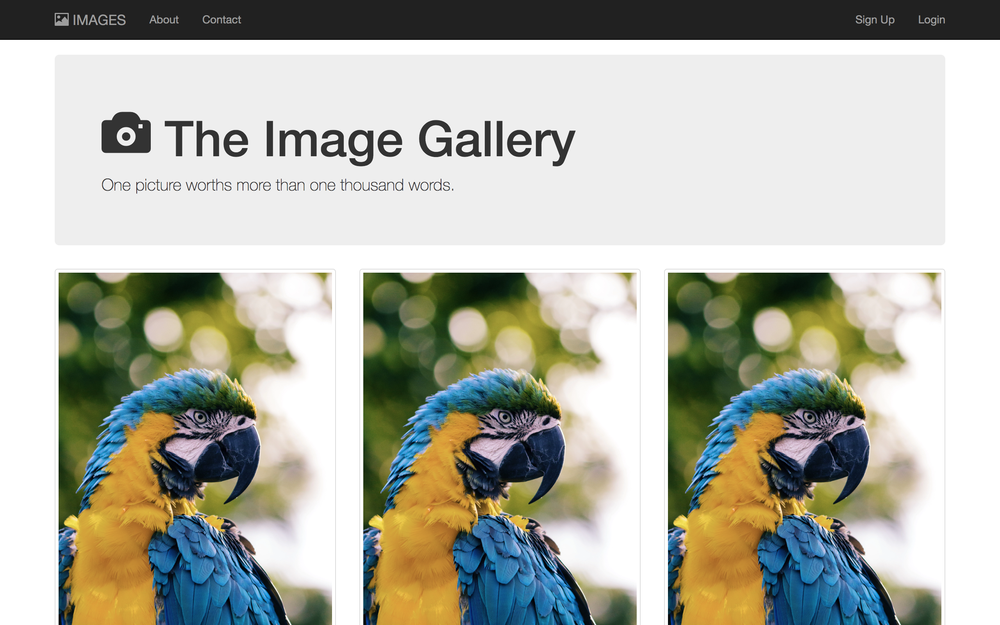
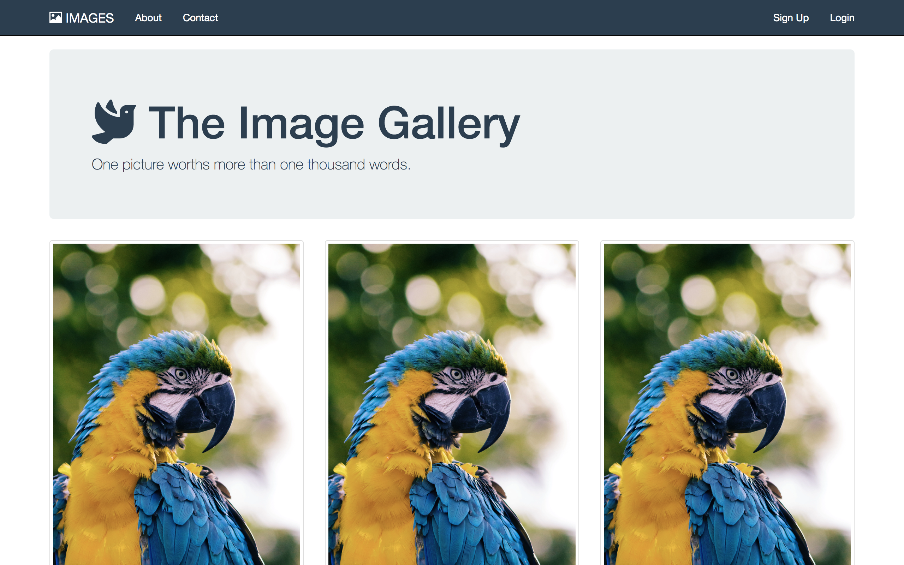

# Section 7 : Bootstrap
- Objective 1: Define Bootstrap and explain why we use it
- Objective 2: Include bootstrap locally and by using a CDN
- Objective 3: Use common Bootstrap components like navs and buttons
- Objective 4: Build a layout using the Bootstrap grid system

## 0 - What is Bootstrap
[Bootstrap](https://getbootstrap.com/) is the most popular HTML, CSS and JS framework for developing responsive, mobile first projects on the web. <br>
[To explore what has been done with Bootstrap.](https://expo.getbootstrap.com/)

## 1 - Adding Bootstrap to a Project

- **Either download** and add **"bootstrap.css"** to your html file <br>
- **Or** visit the [bootstrapcdn.com](https://www.bootstrapcdn.com/) to **get the below link** 

```
<link href="https://stackpath.bootstrapcdn.com/bootstrap/4.3.1/css/bootstrap.min.css" rel="stylesheet" integrity="sha384-ggOyR0iXCbMQv3Xipma34MD+dH/1fQ784/j6cY/iJTQUOhcWr7x9JvoRxT2MZw1T" crossorigin="anonymous">
```

## 2 - Forms and Inputs

> [jumbotron](https://getbootstrap.com/docs/4.3/components/jumbotron/): A lightweight, flexible component that can optionally extend the entire viewport to showcase key content on your site.

If we just put stuff inside of div class container it gives it some spacing some padding around it and it centers things.

> [forms](https://getbootstrap.com/docs/4.3/components/forms/): **form-group**(add some nice spacing) and **form-control**(makes the inputs bootstrap refined) are responsible for making things look good. And **container** for quick bit of spacing on the app.

## 3 - Nav Bars

[bootstrap 3.3.5: CSS](https://maxcdn.bootstrapcdn.com/bootstrap/3.3.5/css/bootstrap.min.css)

```
<link rel="stylesheet" type="text/css" href="https://maxcdn.bootstrapcdn.com/bootstrap/3.3.5/css/bootstrap.min.css">
```

[bootstrap 3.3.5: JAVACSRIPT](https://maxcdn.bootstrapcdn.com/bootstrap/3.3.5/js/bootstrap.min.js)

```
<script src="https://maxcdn.bootstrapcdn.com/bootstrap/3.3.5/js/bootstrap.min.js"></script>
```

[bootstrap 3.3.5: JQUERY](https://code.jquery.com/jquery-2.1.4.js)

```
<script src="https://code.jquery.com/jquery-2.1.4.js"></script>
```

[default navbar](https://getbootstrap.com/docs/3.3/components/#navbar)

## 4 - The Grid System

> Bootstrap includes a responsive, mobile first fluid grid system that appropriately scales up to 12 columns as the device or viewport size increases.

Anytime we use Bootstrap grid, it needs to be inside of a container.

Inside each row, we have 12 units to pick from.

```
    <div class="container">
        <div class="row">
            <div class="col-lg-2 pink">LG - 2</div>
            <div class="col-lg-8 pink">LG - 8</div>
            <div class="col-lg-2 pink">LG - 2</div>
        </div>
    </div>
```

## 5 - Grid System Pt. 2

[For large, medium and small devices](https://getbootstrap.com/docs/4.0/layout/grid/#grid-options)

## 6 - Bootstrap Image Gallery Pt. 1

[Glyphicons](https://www.glyphicons.com/sets/basic/)

```
<span class="glyphicon glyphicon-camera" aria-hidden="true"></span>
<span class="glyphicon glyphicon-picture" aria-hidden="true"></span>
```

## 7 - Bootstrap Image Gallery Pt. 2

- Free images library: [unsplash](https://unsplash.com/)
- **navbar-inverse** to change color and **navbar-fixed-top** to fix the navigation bar to top.

```
<nav class="navbar navbar-inverse navbar-fixed-top">
```
- Grid system **col-lg-4**
- **Jumbotron**

```
<div class="jumbotron"></div>
```

- Bootstrap icons: [glyphicons](https://www.glyphicons.com/sets/basic/)
- The most popular free icons library: [fontawesome](https://fontawesome.com/?from=io)

```
<link rel="stylesheet" href="https://use.fontawesome.com/releases/v5.7.2/css/all.css" integrity="sha384-fnmOCqbTlWIlj8LyTjo7mOUStjsKC4pOpQbqyi7RrhN7udi9RwhKkMHpvLbHG9Sr" crossorigin="anonymous">

<i class="fas fa-dove"></i>
```

- **Thumbnail** to constaint an image into grid and add some spacing around it.

```
<div class="thumbnail"></div>
```

## 8 - Creating a Startup Landing Page Code Along

[Google Fonts - Lato](https://fonts.google.com/specimen/Lato)

```
<i class="fas fa-user-plus"></i>
<i class="fas fa-user"></i>
<i class="fas fa-paw"></i>
```